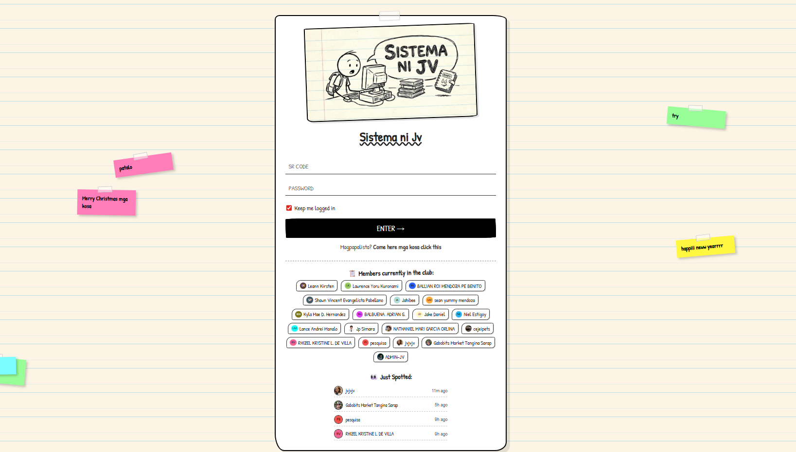
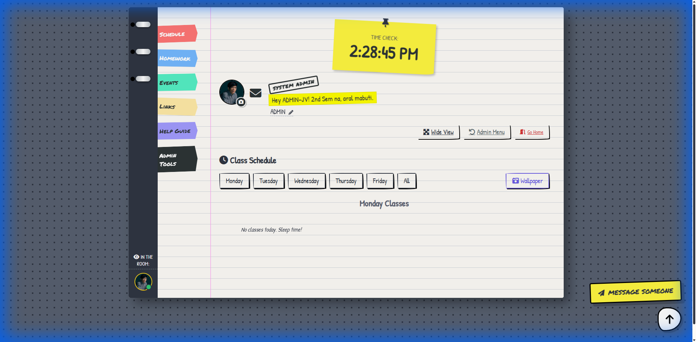
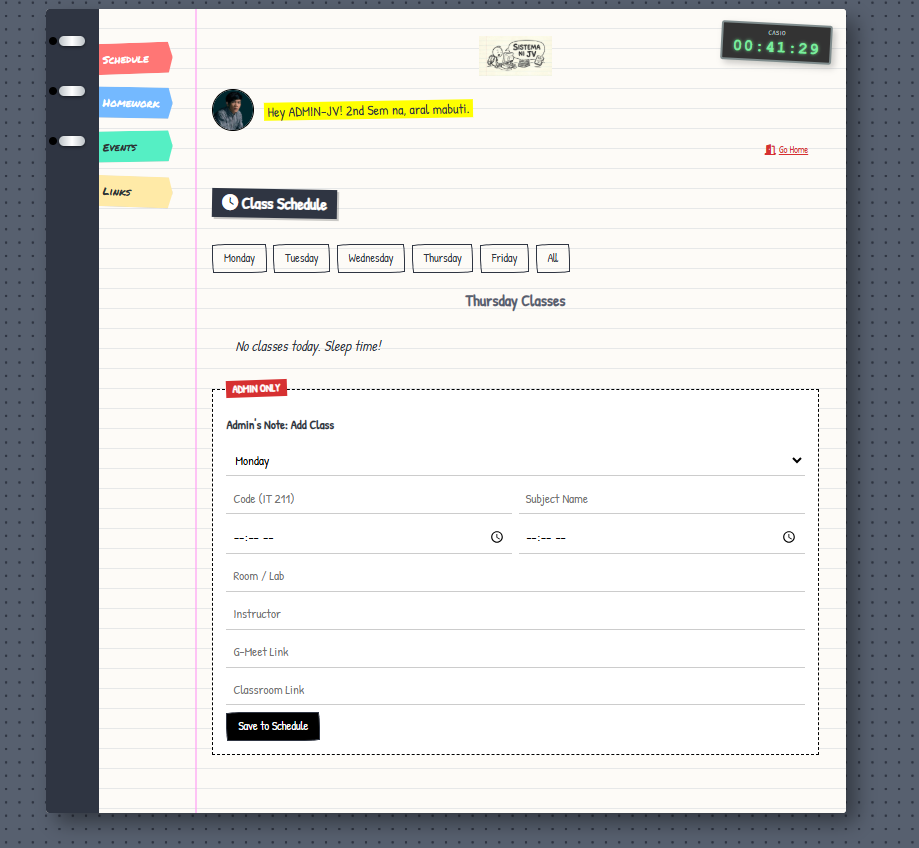

# 📓 The Wimpy Credentials Book (Sistema ni JV)


> *"Ako na ang bahala sa enrollment niyo guys."*

**The Wimpy Credentials Book** is a personalized, web-based Student Companion Application designed to simplify academic management for a close-knit group of students. 

Diverging from sterile, corporate interfaces, this project adopts a **hand-drawn, sketchbook aesthetic** inspired by the *Diary of a Wimpy Kid* series. It combines nostalgic UI elements—like binder rings, tape, and doodles—with powerful real-time database functionality to manage schedules, resources, and student profiles.

---

## 📑 Table of Contents
- [✨ Key Features](#-key-features)
- [📸 Gallery](#-gallery)
- [🛠️ Tech Stack](#-tech-stack)
- [💾 Database Schema](#-database-schema)
- [🚀 Installation & Setup](#-installation--setup)
- [⚠️ Security Note](#-security-note)
- [🤝 Contributing](#-contributing)

---

## ✨ Key Features

### 🎓 Student Dashboard (The Binder)
*   **Dynamic Schedule:** Weekly class viewer with filtering by day.
*   **Live Class Tracker:** A pulsing "Happening Now" card appears automatically when a class is currently in session.
*   **Interactive Calendar:** Monthly view of events; Admins can click days to add events instantly.
*   **Digital Backpack:** Centralized access to homework assignments and deadlines.
*   **Resource Cabinet:** Organized file repository with **Smart Filters** (separating gallery photos from study materials) and **File Previews**.
*   **Help Guide:** A dedicated tab explaining how to navigate the system.
*   **Real-time Clock:** A retro Casio-style watch displaying the current time.

### 🔐 Authentication & Profiles
*   **Memories Gallery:** A "Diary of a Wimpy Kid" style photo gallery on the login page.
*   **Dual-Role Access:** Distinct flows for **Students** (Binder View) and **Admins** (Management View).
*   **Custom Avatars:** Users can upload profile pictures that are stored in the cloud.
*   **Session Management:** "Keep me logged in" functionality for persistent access.
*   **System Update Log:** A visual changelog modal to keep users informed of new features.

### 🛠️ Administrator Controls
*   **Admin Tool Menu:** A centralized navigation bar for managing classes, homework, events, files, and emails.
*   **Storage Monitor:** Real-time visualization of Supabase storage usage (MB/GB) with breakdown by bucket.
*   **User Management:** A "Black List" view to manage registered students, view credentials (for recovery), and delete accounts.
*   **Impersonation Mode:** Admins can "Login as User" to view the dashboard from a specific student's perspective.
*   **Portal Gateway:** A calculated pop-up window to access the official university portal (`dione`) side-by-side.

### 🎨 Interactive UI Elements
*   **Sticky Notes:** Draggable, real-time sticky notes with improved physics.
*   **Wallpaper Generator V2:** Create custom wallpapers with *Glassmorphism* effects or custom backgrounds.
*   **Sketchy Aesthetics:** CSS-driven wobbly borders, hand-written fonts (*Patrick Hand*), and paper textures.
*   **Responsive Design:** Fully functional on desktop and mobile devices.

---

## 📸 Gallery

| **Login Screen** | **Digital Binder** |
|:---:|:---:|
|  |  |

| **Admin Panel** | **Mobile View** |
|:---:|:---:|
|  |  |

---

## 🛠️ Tech Stack

*   **Frontend:**
    *   HTML5 & CSS3 (Flexbox, Grid, CSS Variables, Animations)
    *   JavaScript (Vanilla ES6+)
    *   **Fonts:** Google Fonts (*Patrick Hand*, *Permanent Marker*)
    *   **Icons:** FontAwesome 6.5.2
*   **Backend & Database:**
    *   **Supabase:** PostgreSQL Database, Authentication logic, and File Storage.

---

## 💾 Database Schema

The application requires the following tables in Supabase:

1.  **`students`**: User credentials and profile data.
    *   `id` (uuid), `sr_code` (text), `password` (text), `name` (text), `avatar_url` (text), `last_login` (timestamp), `email` (text), `role` (text).
2.  **`schedule`**: Class timetables.
    *   `id`, `subject_code`, `subject_name`, `start_time`, `end_time`, `day_of_week`, `instructor`, `room`, `meet_link`, `classroom_link`.
3.  **`assignments`**: Homework tracking.
    *   `id`, `title`, `subject`, `description`, `due_date`.
4.  **`events`**: Calendar events.
    *   `id`, `title`, `event_date`, `description`.
5.  **`shared_files`**: Uploaded resources.
    *   `id`, `title`, `subject`, `file_url`, `file_type`.
6.  **`notes`**: Public sticky notes.
    *   `id`, `content`, `x_pos`, `y_pos`, `rotation`, `color`.
7.  **`requests`**: Anonymous messages to admin.
    *   `id`, `content`, `sender`, `created_at`.
8.  **`messages`**: Real-time chat system.
    *   `id`, `sender_id`, `receiver_id`, `content`, `created_at`, `is_read`.

---

## 🛡️ Ethical & Security Standards

The **Wimpy Credentials Book** prioritizes the integrity and privacy of its community. While developed for a specific, close-knit group, the system adheres to strict professional standards:

### **Security Protocols**
*   **Role-Based Access Control (RBAC):** Strict distinction between `Student` and `Admin` roles. Admin capabilities (e.g., file deletion, user management) are protected by server-side verification logic to prevent unauthorized execution via console manipulation.
*   **Session Integrity:** The application implements real-time validation of user sessions. Any attempt to spoof admin privileges via local storage modification is immediately detected, logged, and the unauthorized session is purged.
*   **Navigation Hardening:** Admin-restricted areas (like the "Admin Tools" binder tab) are gated by logic checks that prevent access even if UI elements are forcibly revealed.

### **Data Ethics**
*   **Consent & Privacy:** User data is collected solely for the purpose of academic management and is accessible only to authorized administrators for recovery purposes.
*   **Auditability:** Key actions, such as account recovery or data modification, are performed with explicit confirmation dialogs to prevent accidental loss.
*   **Transparency:** The system includes a visible "System Update" log to keep all users informed of changes to the platform's functionality and security policies.

*> **Note:** This application manages credentials for a trusted circle of peers to facilitate account recovery. In a public production environment, additional layers like password hashing and strict Row Level Security (RLS) would be mandatory.*

---

## 🔄 Latest Updates (Maintenance Patch)

*   **Security:** Fixed navigation loopholes and fortified admin function triggers against console-based exploits.
*   **Architecture:** Refactored codebase into a clean, modular directory structure (`/css`, `/js`, `/assets`) for improved maintainability.
*   **Performance:** Optimized asset loading and extracted inline styles for a smoother user experience.
*   **Feature:** Launched **Message System**, enabling students to leave notes for offline classmates.

---

## 🚀 Installation & Setup

1.  **Clone the Repository**
    ```bash
    git clone https://github.com/yourusername/sistema-ni-jv.git
    cd sistema-ni-jv
    ```

2.  **Supabase Configuration**
    *   Create a new project at [supabase.com](https://supabase.com).
    *   Create the tables listed in the [Database Schema](#-database-schema) section.
    *   **Storage:** Create two public buckets: `avatars` and `class-resources`.
    *   **Realtime:** Enable Realtime for `messages` and `notes` tables.

3.  **Connect the App**
    *   Open `js/script.js` and `js/dashboard.js`.
    *   Replace the `SUPABASE_URL` and `SUPABASE_KEY` constants with your project's credentials.

4.  **Run Locally**
    *   You can use the Live Server extension in VS Code or simply open `index.html` in your browser.

---

## 🤝 Contributing

Contributions are welcome! If you have ideas to make the "Wimpy Kid" vibe even stronger or optimize the code:

1.  Fork the Project.
2.  Create your Feature Branch (`git checkout -b feature/AmazingFeature`).
3.  Commit your Changes (`git commit -m 'Add some AmazingFeature'`).
4.  Push to the Branch (`git push origin feature/AmazingFeature`).
5.  Open a Pull Request.

---

### 📜 License

Distributed under the MIT License. See `LICENSE` for more information.

---

**Built with 🖤 by Joshua Vincent Bitancor**  
*aka "The Enrollment Savior"*