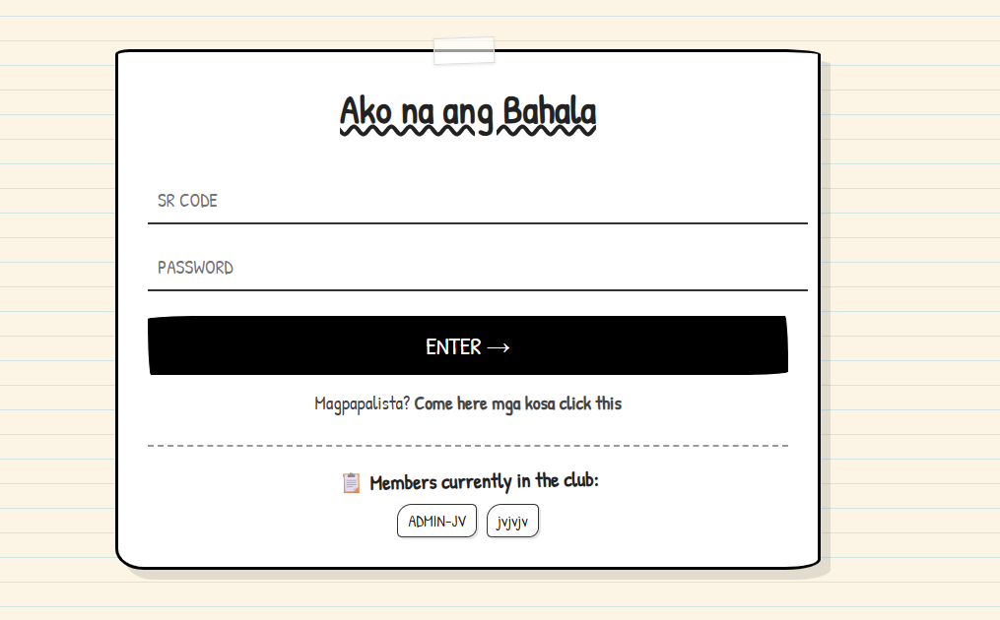
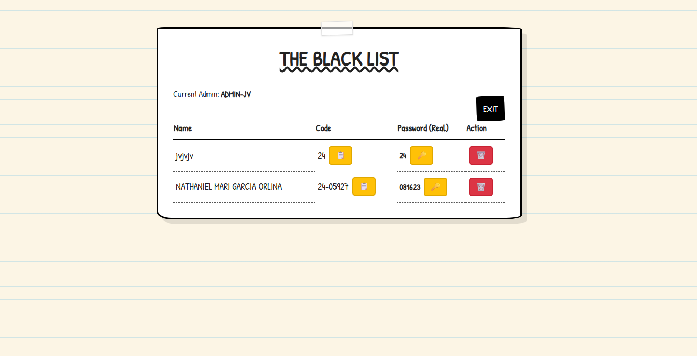
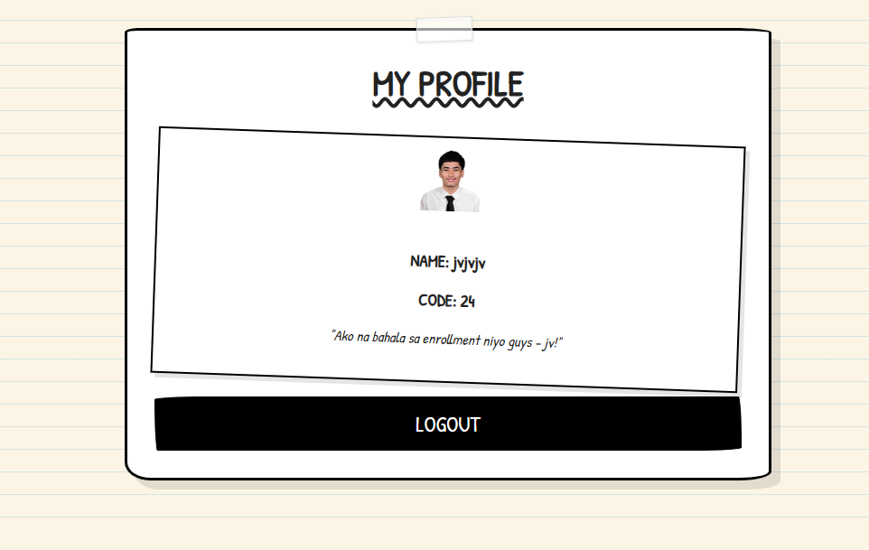

# 📓 The Wimpy Credentials Book
> *Account Management, but make it "Diary of a Wimpy Kid" style.*

## 📖 About The Project
**"Ako na ang bahala sa enrollment niyo guys."**

The **Wimpy Credentials Book** (Sistema ni JV) is a web-based Student Credentials Manager built to simplify the enrollment process for a group of friends ("Mga Kosa"). It is a personalized, digital student binder designed to manage class schedules, assignments, events, and learning resources.

Instead of a boring corporate interface, this project utilizes a **hand-drawn, sketchbook aesthetic** inspired by the *Diary of a Wimpy Kid* series. It features custom CSS animations, wobbly borders, and a paper-texture feel, proving that utility apps can still be fun.

  

## 📸 Screenshots

## ✨ Key Features & Functions

### 🔐 Authentication
- **`handleRegister(name, srCode, password, file)`**: Handles new user registration, including optional profile picture upload to Supabase Storage.
- **`handleLogin(srCode, password)`**: Validates credentials against the database. Routes users to either the Admin Dashboard (if SR Code is 'ADMIN') or the Student Dashboard.
- **`logout()`**: Resets the application state, clears inputs, and returns to the login screen.

### 📌 Assignments & Resources
!Assignments Tab

!Links & Resources

### 🛠️ Admin Dashboard
- **`fetchStudents()`**: Retrieves the full list of registered students (ID, Name, SR Code, Password) from Supabase.
- **`displayStudents(students)`**: Dynamically populates the admin table. Includes "Copy" buttons for SR Codes and Passwords.
- **Search Mechanic**: Real-time filtering of the student list by Name or SR Code via the `searchInput` event listener.
- **`deleteStudent(id)`**: Allows admins to remove users from the database with a confirmation prompt ("Scratch this person out specifically?").
- **`loginAsUser(...)`**: "Instant Login" feature allowing Admins to switch their view to any student's dashboard immediately.
- **`openPortalWindow()`**: Opens the university portal (`dione.batstate-u.edu.ph`) in a centered, standalone pop-up window calculated based on screen size.
- **`addClass(event)`**: Adds a new class to the schedule (Admin form).
- **`addAssignment(event)`**: Posts a new homework assignment (Admin form).
- **`addEvent(event)`**: Creates a new calendar event (Admin form).
- **`uploadFile(event)`**: Uploads a resource file to Supabase Storage (Admin form).

### 📝 Student Features
- **`postNote()`**: Creates sticky notes with randomized colors, rotations, and positions. Saves them to the `notes` table.
- **`fetchNotes()`**: Loads all sticky notes from the database for global display on the "Note Layer".
- **`makeDraggable(element, noteId)`**: Implements drag-and-drop functionality. Includes collision detection logic to prevent notes from overlapping the main content box (`.sketch-box`).
- **`updateNotePosition(id, x, y)`**: Persists the new coordinates (as percentages) of a dragged note to Supabase.
- **Profile Management**: Users can upload a profile picture during registration or update it later by clicking their avatar in the dashboard.
### 📱 Mobile View

### 🧰 Utilities
- **`showToast(message, type)`**: Provides visual feedback (success/error) using custom toast notifications.
- **`copyToClipboard(text)`**: Helper function to copy text to the clipboard, triggering a success toast.
- **`fetchMembers()`**: Updates the public "Members currently in the club" list. Clicking a name triggers `showPublicProfile()` to display user details.
- **`showWelcomeNote()`**: Displays a "hand-written" announcement pop-up upon application load.
| Login Screen | Admin Dashboard | Student Profile |
|:---:|:---:|:---:|
|  |  |  |

## 🎨 UI/UX Design
* **Sketchbook Theme:** Uses the *Patrick Hand* font and CSS gradients to simulate lined paper.
* **Interactive Animations:** Buttons "wiggle" on hover; pages "slide up" like turning a page.
* **Binder UI**: A nostalgic, paper-textured interface with realistic tabs, binder rings, and a Casio-style watch.
* **Dynamic Schedule**: View classes by day of the week. Includes a pulsing "Happening Now" card for live classes.

## 🛠️ Tech Stack
- **Frontend**: HTML5, CSS3 (Custom properties, Flexbox/Grid, Animations), JavaScript (Vanilla).
- **Backend/Database**: Supabase (PostgreSQL).
- **Fonts**: Google Fonts ('Patrick Hand', 'Permanent Marker').
- **Icons**: FontAwesome 6.5.2.

## 🚀 How to Run
1.  **Clone the repo** (or download the files).
2.  Ensure all HTML, JS, and image assets are in the same folder structure.
3.  **Configure Supabase:**
    *   Create a Supabase project.
    *   Set up tables: `students` (id, name, sr_code, password, avatar_url) and `notes` (id, content, x_pos, y_pos, rotation, color).
    *   **Storage Setup:** Create a public bucket named `avatars`. **Important:** Configure Storage Policies to allow "Anon" (public) uploads, updates, and selects.
    *   Update `SUPABASE_URL` and `SUPABASE_KEY` in `dashboard.js` and `script.js`.
4.  **Open `index.html`** in any modern web browser.

## ⚠️ Note on Security
**Context:** This application was built specifically for a closed group of trusted friends.
* **Design Choice:** Password hashing is **disabled** to allow the Admin to recover passwords for friends.
* **CRITICAL:** For any public or production environment, **you MUST implement password hashing** (e.g., Bcrypt). Do not use this code as-is for sensitive data.

## 🤝 Contributing
Feel free to fork the repository and adapt it for your own needs!
1. Clone the repository.
2. Ensure you have the `logo.png` in the root directory.
3. Configure your Supabase credentials in `dashboard.js` and `script.js`.
4. Open `index.html` in your browser.

## 📄 License
MIT License.

## 📂 Project Structure
- `web2.html`: The main entry point containing the structure and styles.
- `dashboard.js`: Handles logic, Supabase connection, and DOM manipulation.
- `logo.png`: Project branding.

---
Built with 🖤 by **Joshua Vincent Bitancor** *aka "The Enrollment Savior"*  
*Inspired by Jeff Kinney's Diary of a Wimpy Kid.*
