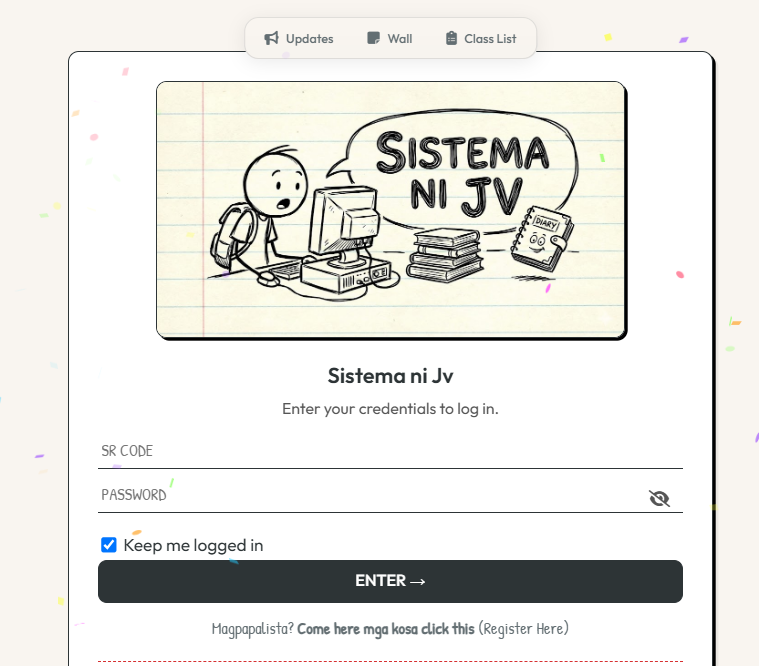
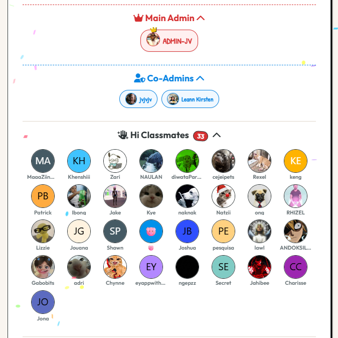
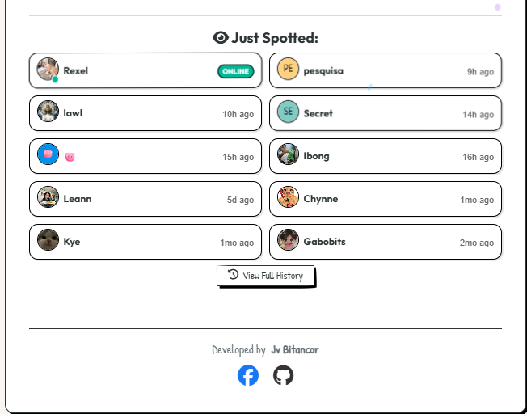
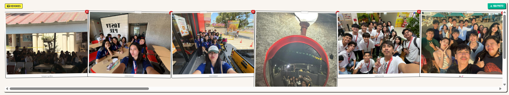
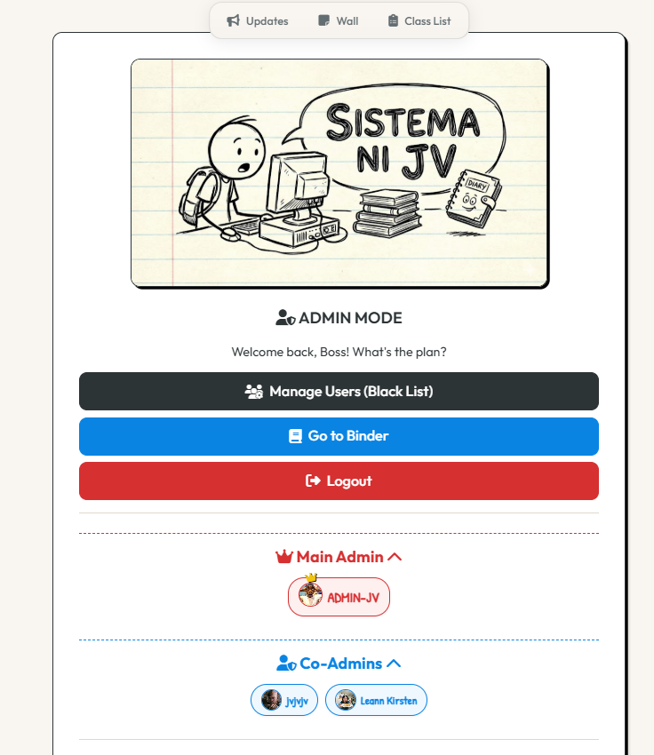
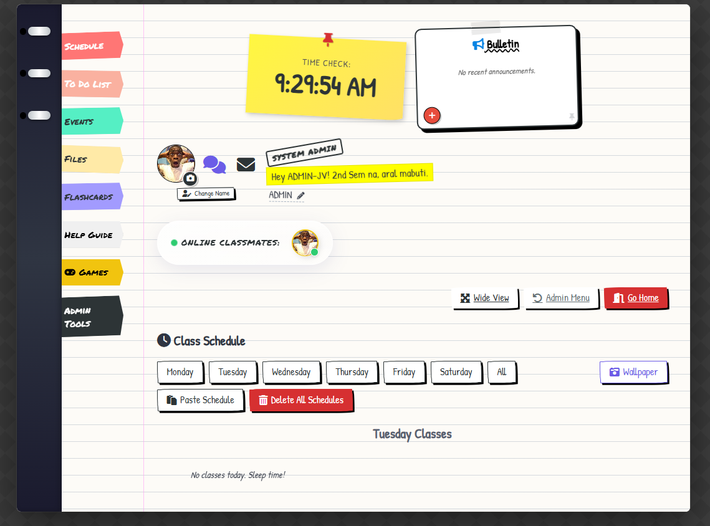
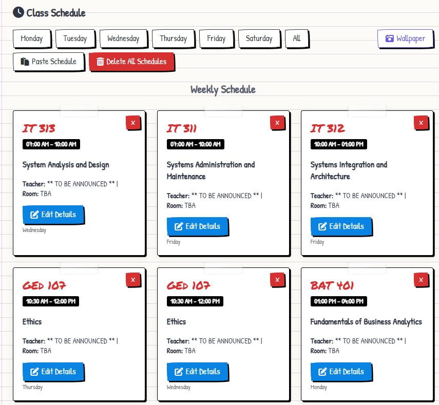
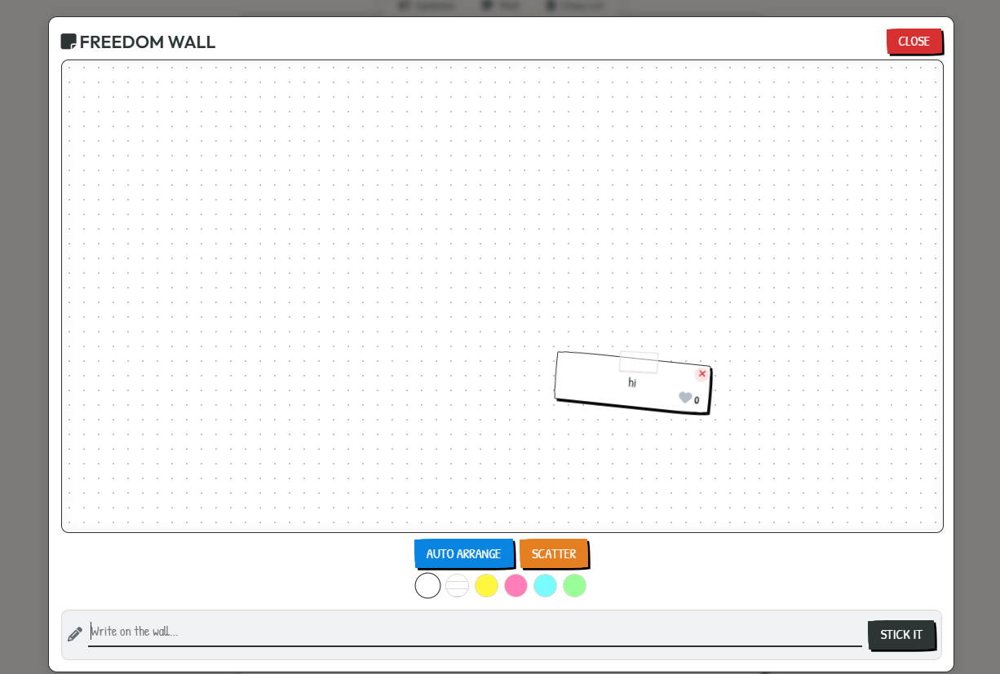
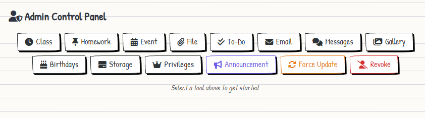
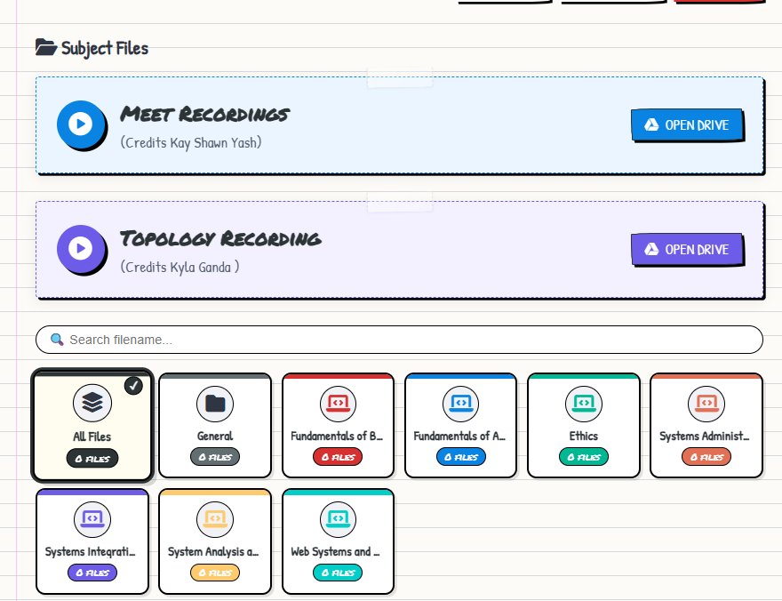

# The Wimpy Credentials Book

[](https://github.com/yourusername/sistema-ni-jv)
[]()
[]()

> A real-time student companion application with a hand-drawn sketchbook aesthetic.

The Wimpy Credentials Book is a web-based academic management platform designed for a close-knit group of students. It combines a custom sketch-style UI with Supabase-powered real-time features, bringing together class schedules, file sharing, messaging, calendar events, and administrative tools in one cohesive experience.

---

## Features

### Student Experience
- **Live Schedule** — Weekly class timetable with a pulsing "Happening Now" indicator for active classes
- **Resource Cabinet** — Organized file repository with filters, previews (PDF, images, video), and download
- **Interactive Calendar** — Monthly event view with click-to-add for admins
- **Freedom Wall** — Real-time collaborative sticky note board with draggable physics
- **Messaging System** — Peer-to-peer chat with read receipts and inbox management
- **Homework Tracker** — Assignment deadlines displayed on the dashboard

### Administration
- **Admin Tool Panel** — Centralized forms for managing classes, homework, events, files, and broadcasts
- **Student Management** — Registration handling, role promotion/revocation, enrollment tracking
- **File Management** — Gallery uploads, receipt collection, storage usage monitoring
- **Email Broadcasting** — Send announcements to all students or specific recipients
- **Real-time Announcements** — Pop-up broadcast to all active sessions

### Real-time & Interactive
- **Live Presence** — "Recently Spotted" section showing active users
- **Group Chat** — Real-time group messaging with typing indicators
- **Creature Battles** — Lightweight multiplayer game between students
- **System Updates** — Auto-expiring announcements with comment threads

---

## Tech Stack

| Layer | Technology |
|-------|-----------|
| Frontend | HTML5, CSS3 (Flexbox, Grid, CSS Variables, Animations), Vanilla JavaScript (ES6+) |
| Backend | Supabase (PostgreSQL, Realtime, Storage, Auth) |
| Fonts | Patrick Hand, Outfit (Google Fonts) |
| Icons | FontAwesome 6.5 |
| APIs | EmailJS, html2canvas, PDF.js |

> **No framework, no bundler.** The entire application is built with vanilla HTML/CSS/JS, served as a static site (GitHub Pages compatible). All real-time features are powered by Supabase Realtime channels.

---

## Architecture

```
┌─────────────────────────────────────────────────┐
│                 Static Hosting                    │
│  (GitHub Pages / any static file server)          │
│                                                   │
│  index.html  ── script.js                         │
│  web2.html   ── dashboard.js, admin.js,           │
│                 messaging.js, group-chat.js        │
│  css/         ── common.css, auth.css, admin.css   │
│  js/          ── config.js, common.js              │
└──────────┬──────────────────────────┬─────────────┘
           │                          │
           ▼                          ▼
    ┌──────────────┐        ┌──────────────────┐
    │  Supabase     │        │  Supabase         │
    │  REST API     │        │  Realtime         │
    │  (CRUD ops)   │        │  (WebSocket)      │
    └──────┬───────┘        └────────┬─────────┘
           │                         │
           ▼                         ▼
    ┌──────────────────────────────────────────┐
    │         PostgreSQL Database                │
    │  Tables: students, schedule, assignments,  │
    │  events, shared_files, notes, messages,    │
    │  requests, user_statuses, flashcards,      │
    │  global_todos, todo_completions            │
    └──────────────────────────────────────────┘
```

### Data Flow
1. Client-side JavaScript authenticates via Supabase anon key (application-level auth)
2. All CRUD operations go through Supabase REST API (PostgREST)
3. Real-time features (chat, announcements, presence) use Supabase Realtime WebSocket channels
4. File uploads stored in Supabase Storage buckets (`avatars`, `class-resources`)

---

## Database Schema

| Table | Purpose | Key Columns |
|-------|---------|-------------|
| `students` | User accounts & profiles | id, sr_code, name, role, enrollment_status, battle_wins |
| `schedule` | Weekly class timetable | subject_code, start_time, end_time, day_of_week, room |
| `assignments` | Homework tracking | title, subject, description, due_date |
| `events` | Calendar events | title, event_date, description |
| `shared_files` | Uploaded resources | title, subject, file_url, file_type, created_at |
| `notes` | Sticky notes, announcements, comments, chat messages | content, color (discriminator), x_pos, y_pos, rotation |
| `messages` | Peer-to-peer chat | sender_id, receiver_id, content, is_read |
| `requests` | Anonymous messages to admin | content, sender, created_at |
| `user_statuses` | Online presence tracking | user_id, status |
| `flashcards` | Resource links (auto-delete 7 days) | topic, link, description |
| `global_todos` | Admin-created tasks | task_name, created_by |
| `todo_completions` | Task completion tracking | todo_id, user_id |

> **Note:** The `notes` table serves as a polymorphic store — the `color` column discriminates between sticky notes, global announcements, comments, group chat messages, wordle words, and file view logs.

---

## Screenshots

| Auth & Memories Gallery | Member List & Fresh Drops |
|:---:|:---:|
|  |  |

| Recent Logins & Spotted | Memories Section |
|:---:|:---:|
|  |  |

| Admin Role Selection | Student Dashboard (The Binder) |
|:---:|:---:|
|  |  |

| Weekly Class Schedule | Real-time Freedom Wall |
|:---:|:---:|
|  |  |

| Admin Management Tools | Digital Resource Cabinet |
|:---:|:---:|
|  |  |

---

## Quick Start

```bash
# Clone the repository
git clone https://github.com/yourusername/sistema-ni-jv.git
cd sistema-ni-jv

# Serve locally (any static file server)
npx serve .
```

1. Create a Supabase project at [supabase.com](https://supabase.com)
2. Create the tables listed in the schema section
3. Enable Realtime for `messages` and `notes` tables
4. Create public storage buckets: `avatars`, `class-resources`
5. Update `SUPABASE_URL` and `SUPABASE_KEY` in `js/config.js`
6. Open `http://localhost:3000` in your browser

---

**Built by Joshua Vincent Bitancor**
